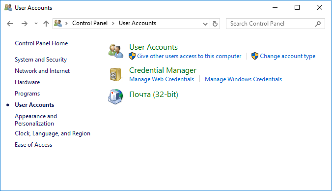
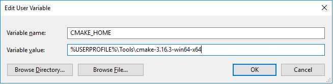
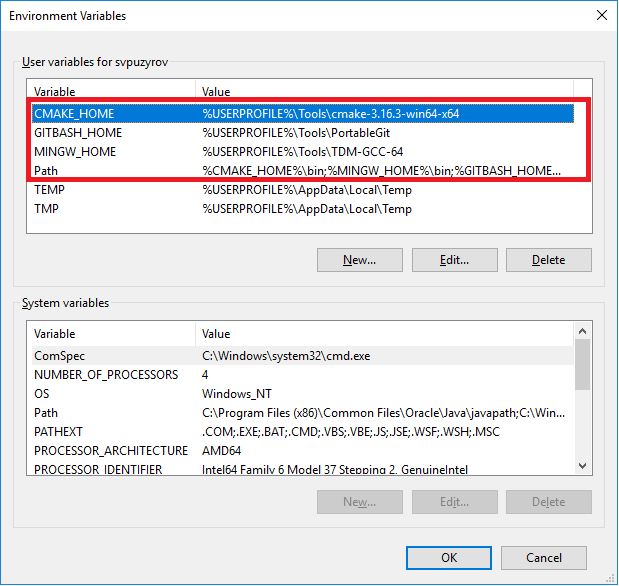
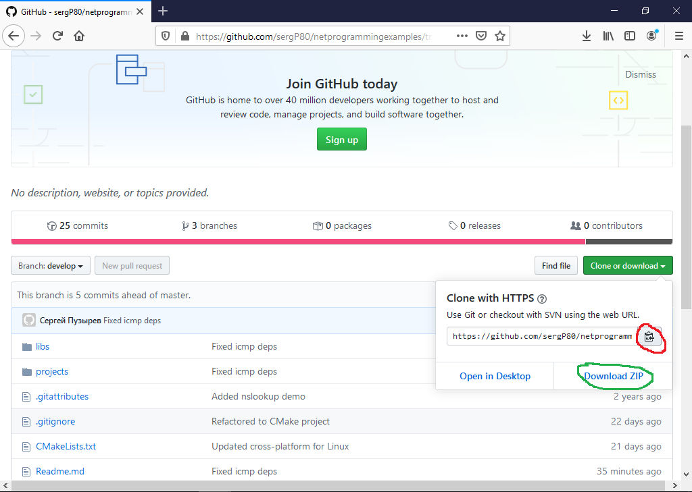
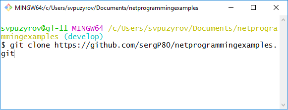

## Network programming based on socket API. Examples

### Pre-requests
Before build projects need to make sure that you have at least following tools:
* cmake
* git
* gcc

#### Linux (Ubuntu)
Perform the following command

`sudo apt-get -y update`

`sudo apt-get -y installbuild-essential git cmake`

#### Windows
Download the required tools using the following links
* [mingw (tdm x64)](https://github.com/jmeubank/tdm-gcc/releases/download/v9.2.0-tdm64-1/tdm64-gcc-9.2.0.exe)
* [cmake (zip x64)](https://github.com/Kitware/CMake/releases/download/v3.16.5/cmake-3.16.5-win64-x64.zip)
* [git (portable)](https://github.com/git-for-windows/git/releases/download/v2.25.1.windows.1/PortableGit-2.25.1-64-bit.7z.exe)

Unpack all packages into one local directory (for ex. `Tools`).

Add paths to its at the end of `PATH` variable.

Go to `Control Panel` and select `User Accounts`



Click to `User Accounts` again


and click to `Change my environment variables`. After this you can see
dialog where you can add separated variables and reference to them from `PATH` variable.

Click to `New...` button and fill the dialog (ex. for `cmake`)



There is final case of variables and path below



*Note* Use only MinGW `x64` because `x86` does not contain `icmp` lib

*Note* If you have `Visual Studio` at least 2013 then you can open CMake project via
`File -> Open -> CMake...`

### Download project

Go to GitHub-project page and click to `Click or download` button.



In pop-up dialog click to copy-button (marked red color). Now you copy url of project.

Then go to any your local folder (ex. Documents), type `git-bash` in address line and 
in console type 

`git clone`

and press `SHIFT` + `Ins`. You could see something one



Press `Enter` and wait for cloning of project

*Note* You can clone project into specific folder using `git clone <project url> <folder>`

*Note* If you have problem to clone - use `Download ZIP` button in project page
and download its via ZIP-archive.

*Note* Newer features are in `develop branch` so after cloning don''t forget to switch to 
this branch via `git checkout develop`

### Builds

Go to project root folder, create `build` folder and go to it.

* Linux
   Execute `cmake ..` to generate make-files.
   After this perform `make` to build project.

* Windows
  Execute `cmake -G "MinGW Makefiles" ..` to generate make-files.
  After this perform `mingw32-make`

When build is finished you can see `dist` folder with following structures

```
build
|--dist
|   |--bin
|   |    |--Linux<Windows>
|	|		|--x86_64<AMD64>
|	|		   |--ip_ping<.exe>
|	|		   |--....
|	|--lib
|	|  |--Linux<Windows>
|	|     |--x86_64
|	|        |--libcommon_net.a<common_net.lib>
|	|        |--....
```

### Examples
* [TCP](docs/tcp/tcp.md)
* [UDP](docs/udp/udp.md)
* [Mulitcast](docs/multicast/multicast.md)
